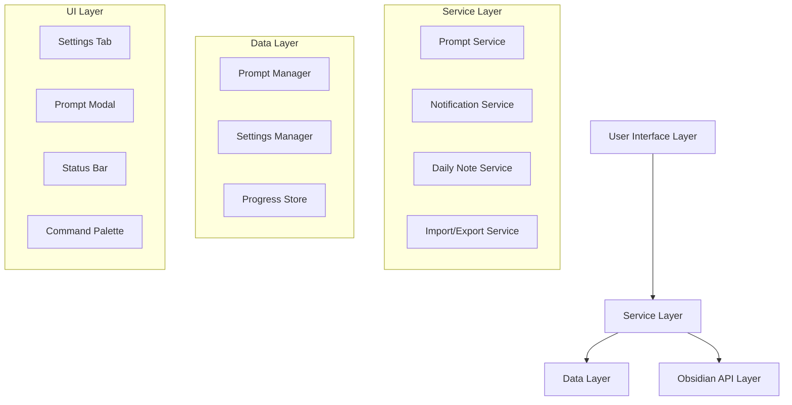

# Design Document

## Overview

The Obsidian Daily Prompts plugin is designed as a TypeScript-based Obsidian plugin that provides a comprehensive prompt management system. The plugin follows Obsidian's plugin architecture patterns and integrates deeply with the daily notes functionality. The system is built around a modular architecture that separates concerns between prompt management, notification scheduling, daily note integration, and user interface components.

## Architecture

The plugin follows a layered architecture with clear separation of concerns:



### Core Components

1. **Plugin Main Class**: Extends Obsidian's Plugin class, handles lifecycle and initialization
2. **Prompt Service**: Manages prompt selection logic for different delivery modes
3. **Notification Service**: Handles scheduling and delivery of notifications
4. **Daily Note Service**: Manages integration with daily notes and zen mode
5. **Import/Export Service**: Handles JSON serialization and file operations
6. **Settings Manager**: Manages plugin configuration and user preferences
7. **Progress Store**: Tracks completion status and user progress

## Components and Interfaces

### Data Models

```typescript
interface PromptPack {
  id: string;
  name: string;
  type: 'Sequential' | 'Random' | 'Date';
  prompts: Prompt[];
  settings: PromptPackSettings;
  progress: PromptProgress;
  createdAt: Date;
  updatedAt: Date;
}

interface Prompt {
  id: string;
  content: string;
  type: 'link' | 'string' | 'markdown';
  date?: Date; // For Date-type packs
  order?: number; // For Sequential-type packs
  metadata?: Record<string, any>;
}

interface PromptPackSettings {
  notificationEnabled: boolean;
  notificationTime: string; // HH:MM format
  notificationType: 'system' | 'obsidian';
  zenModeEnabled: boolean;
  dailyNoteIntegration: boolean;
  customTemplate?: string;
}

interface PromptProgress {
  completedPrompts: Set<string>;
  currentIndex?: number; // For Sequential mode
  usedPrompts?: Set<string>; // For Random mode
  lastAccessDate: Date;
}

interface PluginSettings {
  promptPacks: PromptPack[];
  globalSettings: GlobalSettings;
}

interface GlobalSettings {
  defaultNotificationTime: string;
  defaultZenMode: boolean;
  dailyNoteFolder: string;
  dailyNoteTemplate: string;
  linkHandling: 'embed' | 'reference' | 'direct';
}
```

### Service Interfaces

```typescript
interface IPromptService {
  getNextPrompt(packId: string): Promise<Prompt | null>;
  markPromptCompleted(packId: string, promptId: string): Promise<void>;
  resetProgress(packId: string): Promise<void>;
  getProgress(packId: string): PromptProgress;
}

interface INotificationService {
  scheduleNotification(pack: PromptPack): void;
  cancelNotification(packId: string): void;
  showNotification(prompt: Prompt, pack: PromptPack): void;
  checkMissedNotifications(): Promise<void>;
}

interface IDailyNoteService {
  createOrOpenDailyNote(date?: Date): Promise<TFile>;
  insertPrompt(prompt: Prompt, file: TFile): Promise<void>;
  enableZenMode(): void;
  disableZenMode(): void;
}

interface IImportExportService {
  exportPack(pack: PromptPack): Promise<string>;
  importPack(jsonData: string): Promise<PromptPack>;
  validatePackFormat(jsonData: string): boolean;
}
```

## Architecture Details

### Prompt Selection Logic

**Sequential Mode:**
- Maintains a current index in the progress store
- Returns prompts in defined order
- Advances index after each completion
- Handles completion by offering restart options

**Random Mode:**
- Uses a Set to track used prompts
- Randomly selects from unused prompts
- Resets used set when all prompts are completed
- Ensures no repetition within a cycle

**Date Mode:**
- Filters prompts by current date
- Handles timezone considerations
- Provides catch-up mechanism for missed dates
- Supports date ranges and recurring patterns

### Notification System

The notification system integrates with both Obsidian's internal notification system and the browser's native notification API:

**Obsidian Notifications:**
- Uses `Notice` class for in-app notifications
- Integrates with Obsidian's notification queue
- Provides action buttons for immediate prompt access

**System Notifications:**
- Uses browser's `Notification` API
- Requires user permission
- Includes click handlers to focus Obsidian and open prompts
- Fallback to Obsidian notifications if system notifications unavailable

**Scheduling:**
- Uses `setInterval` for periodic checks
- Stores next notification time in plugin data
- Handles timezone changes and system sleep/wake
- Implements retry logic for failed notifications

### Daily Note Integration

The daily note integration leverages Obsidian's daily notes plugin API and file system:

**Note Creation:**
- Uses daily notes plugin API when available
- Falls back to manual file creation with date formatting
- Respects user's daily note folder and template settings
- Handles existing notes by appending to them

**Content Insertion:**
- Parses existing note content to find appropriate insertion point
- Supports custom templates with placeholder replacement
- Handles different prompt types with appropriate formatting
- Maintains note structure and existing content

**Zen Mode Integration:**
- Uses Obsidian's workspace API to hide UI elements
- Configurable UI element hiding (sidebar, status bar, etc.)
- Automatic restoration when prompt session ends
- Integration with existing zen mode plugins if present

## Data Models

### Storage Strategy

The plugin uses Obsidian's data storage API (`saveData`/`loadData`) for persistence:

**File Structure:**
```
.obsidian/plugins/daily-prompts/
├── data.json (main plugin data)
├── progress/ (individual progress files)
│   ├── pack-1-progress.json
│   └── pack-2-progress.json
└── backups/ (automatic backups)
    ├── data-backup-2024-01-01.json
    └── progress-backup-2024-01-01.json
```

**Data Serialization:**
- JSON format for all stored data
- Automatic migration for schema changes
- Compression for large prompt packs
- Backup creation before major operations

### Import/Export Format

```json
{
  "version": "1.0.0",
  "pack": {
    "id": "uuid-v4",
    "name": "Daily Reflections",
    "type": "Sequential",
    "prompts": [
      {
        "id": "prompt-1",
        "content": "What are you grateful for today?",
        "type": "string",
        "order": 1
      }
    ],
    "settings": {
      "notificationEnabled": true,
      "notificationTime": "09:00",
      "notificationType": "system"
    }
  },
  "metadata": {
    "exportedAt": "2024-01-01T09:00:00Z",
    "exportedBy": "Daily Prompts Plugin v1.0.0"
  }
}
```

## Error Handling

### Error Categories

1. **Data Corruption**: Invalid JSON, missing files, schema mismatches
2. **Permission Errors**: File system access, notification permissions
3. **API Failures**: Obsidian API unavailable, daily notes plugin missing
4. **Network Issues**: Import/export operations, external link resolution
5. **User Input Errors**: Invalid configurations, malformed imports

### Error Recovery Strategies

**Data Corruption:**
- Automatic backup restoration
- Schema migration with fallbacks
- Graceful degradation with default values
- User notification with recovery options

**Permission Errors:**
- Graceful fallback to alternative methods
- Clear user messaging about required permissions
- Retry mechanisms with exponential backoff
- Alternative notification methods

**API Failures:**
- Feature detection and graceful degradation
- Alternative implementation paths
- User notification about missing dependencies
- Fallback to core Obsidian APIs

## Testing Strategy

### Unit Testing

**Test Coverage Areas:**
- Prompt selection algorithms for all modes
- Data serialization and deserialization
- Progress tracking and state management
- Notification scheduling logic
- Import/export validation

**Testing Framework:**
- Jest for unit testing
- Mock Obsidian API for isolated testing
- Property-based testing for prompt selection
- Snapshot testing for UI components

### Integration Testing

**Integration Points:**
- Obsidian API integration
- Daily notes plugin compatibility
- File system operations
- Notification system integration
- Zen mode activation

**Test Scenarios:**
- End-to-end prompt delivery workflow
- Import/export round-trip testing
- Multi-pack management scenarios
- Error recovery and fallback testing
- Performance testing with large prompt sets

### Manual Testing

**User Scenarios:**
- First-time setup and configuration
- Daily usage patterns across different modes
- Import/export workflows
- Notification handling across different times
- Integration with existing daily note workflows

**Edge Cases:**
- System timezone changes
- Obsidian restart during active sessions
- Corrupted data recovery
- Large prompt pack performance
- Concurrent access scenarios

### Performance Considerations

**Optimization Strategies:**
- Lazy loading of prompt packs
- Efficient progress tracking with minimal I/O
- Debounced settings updates
- Cached prompt selection for Random mode
- Background processing for non-critical operations

**Memory Management:**
- Cleanup of notification timers
- Proper event listener removal
- Efficient data structure usage
- Garbage collection considerations for long-running sessions